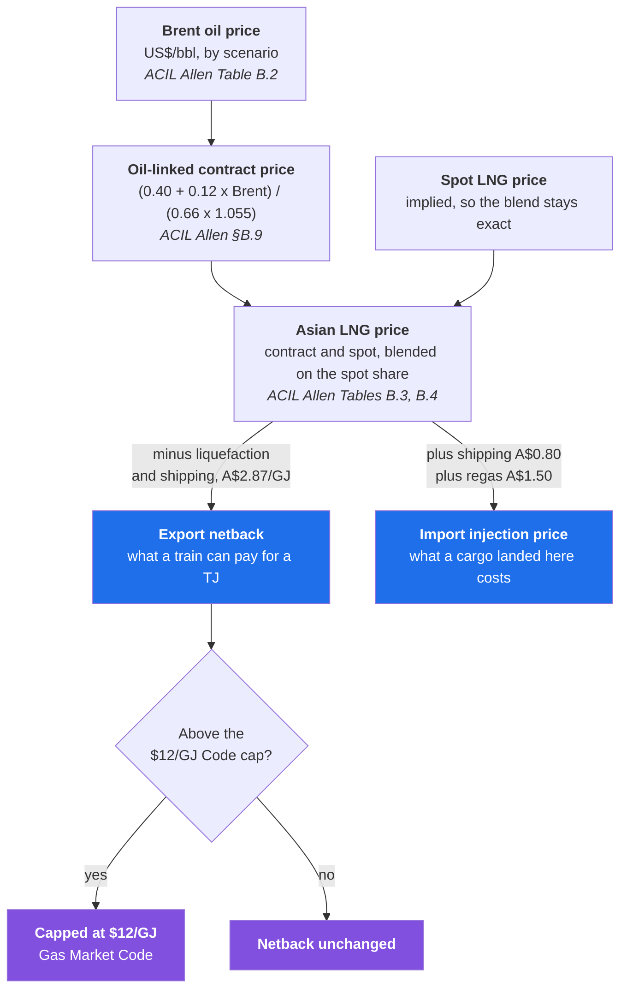
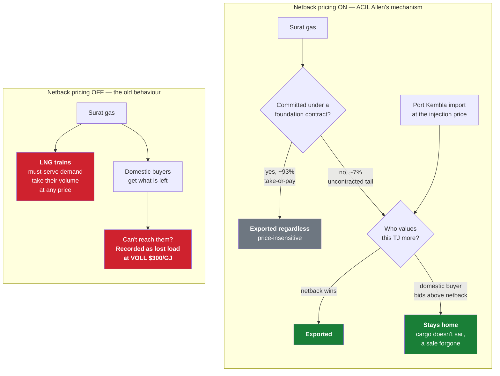

# GARY — Gas Allocation and Regional Yield Model

# Draft model 

A nodal, least-cost gas market optimisation model for the Australian energy transition (2025–2050), with an interactive scenario explorer dashboard.

## Requirements

The only thing you need to install manually is **Python 3.10 or later**:

- Windows: https://www.python.org/downloads/ — tick **"Add Python to PATH"** during install
- Mac: https://www.python.org/downloads/ or `brew install python`
- Linux: `sudo apt install python3 python3-venv` (Ubuntu/Debian)

All other dependencies (Dash, Plotly, Pyomo, HiGHS, etc.) are installed **automatically** the first time you run the app.

GARY can also run on the **GLPK** solver instead of HiGHS — see [Choosing a solver](#choosing-a-solver).

## Installation & Running

**Windows**
```
git clone https://github.com/mhs795/GARY-gas-allocation-and-regional-yield.git
cd GARY-gas-allocation-and-regional-yield
run_dashboard.bat
```

**Mac / Linux**
```
git clone https://github.com/mhs795/GARY-gas-allocation-and-regional-yield.git
cd GARY-gas-allocation-and-regional-yield
./run_dashboard.sh
```

The first run will take 2–3 minutes while dependencies install. After that, open your browser to:

**http://127.0.0.1:8050**

> **Note:** The `GAS` terminal command only works on Linux/Mac after adding the project folder to your PATH. Everyone else should use the scripts above.

## Using the Dashboard

> **First run on a fresh clone:** the model's generated data files are not committed
> (only source inputs are). Click **Regenerate All Data** once to rebuild every
> derived data file from source, then **Run Scenarios** to populate the results
> cache. After that the two-button workflow only needs repeating when source inputs change.

1. Pick a **GSOO Baseline** scenario — **Step Change**, **Accelerated Transition**, or **Slower Growth** — in the sidebar
2. Set **Winter Stress** and **LNG Demand** levels (these layer on top of the chosen baseline)
2. Optionally switch on **Gas reservation** and pick the share of LNG exports to reserve (5/10/20/30%),
   and/or **Price-responsive demand**
2b. Optionally enter **Data centre gas demand** in PJ/yr for NSW and VIC and set the year it starts — or link a spreadsheet under **Or link a demand series** to give a year-by-year series instead of one flat volume (see [Data centre gas demand](#data-centre-gas-demand))
2c. **LNG netback pricing (ACIL Allen)** is **on by default** — exports and imports are priced off the international market, and **Global LNG Market** selects a netback price path rather than scaling export volume. Switch it off to revert to must-serve exports (see the warning under [LNG netback price formation](#lng-netback-price-formation-acil-allen-methodology))
2d. With a reservation on, **Respect LNG foundation contracts** decides whether it may only take uncontracted export gas (capped at 7%) or may break take-or-pay SPAs
2e. Optionally switch on **GSOO expansions only** to restrict the capacity model to the expansions AEMO counts as committed in the 2026 GSOO/VGPR, dropping every pre-FID and proposed candidate — see [Network expansion candidates](#network-expansion-candidates)
3. Click **Run Scenario** to solve one combination
4. Click **Run Scenarios** to pre-calculate **every combination** — all 3 baselines × 3 Winter × 3 LNG = 27 scenarios, plus the SA dunkelflaute case
5. Click **Run Reservation Scenarios** to sweep **every reservation level × every GSOO baseline** — 5 levels (0/5/10/20/30%) × 3 baselines = 15 runs — at the Winter and LNG levels currently selected. This button sweeps the baseline dropdown and the reservation toggle itself, so both are ignored while it runs; every other sidebar setting is honoured. Each baseline gets its own 0% run, because a reservation is only readable against the same case without one
6. Click **Regenerate All Data** to rebuild all derived demand data from source (GBB + GSOO, all three baselines)
7. Explore results across 6 tabs: Network Map, Production, Storage, Prices, Expansions, Industrial Use

Both sweeps skip scenarios already in the cache and save each one as it finishes, so
an interrupted sweep keeps everything that completed. **Clear Results** forces a
full rebuild.

### How long a sweep takes

Sweeps run several scenarios at once, one process each — see
[Parallel sweeps](#parallel-sweeps).

## Project Structure

| Path | Description |
|---|---|
| `src/dashboard.py` | Dash web app |
| `src/model.py` | Pyomo optimisation model |
| `src/solve.py` | Scenario solver |
| `src/solvers.py` | Solver backend selection (HiGHS / GLPK) |
| `src/sweep.py` | Runs independent scenarios across worker processes |
| `src/results_io.py` | Compressed, column-oriented scenario-results cache |
| `src/regenerate_data.py` | One-button rebuild of all derived data from source |
| `src/build_*.py` | GSOO/GBB demand-build pipeline (see below) |
| `src/data/gary_parameters.xlsx` | Every model parameter (scalars, levers, price anchors) |
| `src/data/expansion_options.csv` | Network expansion candidates, tagged GSOO / market |
| `src/data/` | Network nodes, pipelines, supply, demand, contracts |
| `requirements.txt` | Python dependencies |

The demand data is rebuilt from source by `src/regenerate_data.py` (the **Regenerate
All Data** button), which runs the build pipeline in dependency order:
`build_curtailable_demand` → `build_gsoo_scenarios` → `build_gpg_demand_gsoo` →
`build_industrial_demand_gsoo` → `build_demand_gsoo`. The GSOO extract pulls all
three baseline scenarios, and the demand builders emit one set of demand files per
baseline (e.g. `demand_StepChange.csv`, `demand_Accelerated.csv`, `demand_SlowerGrowth.csv`).

## Choosing a solver

The optimisation is written in Pyomo, so the underlying solver is swappable. Two
backends are supported:

| Backend | Pyomo interface | Notes |
|---|---|---|
| `highs` (default) | `appsi_highs` | Multi-threaded, installed via pip (`highspy`). All published GARY results use this. |
| `glpk` | `glpsol` | Single-threaded, pure system package. Slower on the full-horizon dispatch, but no Python extension module needed. |

GLPK is **not** a pip dependency — install the system package:

```
sudo apt install glpk-utils          # Debian / Ubuntu / Pop!_OS
brew install glpk                    # macOS
```

Select a backend with the `--solver` flag or the `GARY_SOLVER` environment variable:

```
./gas                                # HiGHS (default)
./gas --glpk                         # GLPK, dashboard and all
./gas --solver glpk                  # same thing, long form
GARY_SOLVER=glpk ./gas               # via the environment

python src/solve.py --solver glpk    # single scenario, headless
python src/main.py --solver glpk
python src/batch_solve.py --solver glpk
```

Optionally cap each individual solve with `GARY_SOLVER_TIMELIMIT` (seconds), which
is mainly useful for GLPK:

```
GARY_SOLVER_TIMELIMIT=600 ./gas --glpk
```

**Do the two agree?** Yes, to within the MIP gap. On a 2030 single-year dispatch both
solvers reach an identical optimum (objective 7,611,822,687.71) when the gap is
tightened to 0.01%. At the default 0.5% gap they can stop at different incumbents of
near-equal cost, so the *build schedule can differ* where projects are close to a tie
— e.g. the capacity model puts `MSP_Expansion` at 2025 under HiGHS and 2027 under
GLPK, with `SWQP_Expansion` at 2025 in both. Tighten `mip_gap` if you need the two to
line up exactly.

**Speed.** GLPK is slower, but on a full run the difference is modest — the
26-year solve is dominated by the 365-day LP dispatch, where the two are close;
the gap would widen on a harder MILP. Measured on the Step Change baseline,
Medium winter / Medium LNG, full 2025–2050 two-stage solve:

| Stage | HiGHS | GLPK |
|---|---|---|
| Capacity-expansion MILP | 5.1 s | 5.7 s |
| Single-year dispatch (2030) | 10.8 s | 13.5 s |
| Full 26-year run | 302 s | 328 s |

## Parallel sweeps

A sweep is a set of scenarios that share nothing — each loads its own data, solves
its own capacity model and dispatches its own 26 years — so the scenario is the unit
of parallelism. `src/sweep.py` runs them in worker processes, one solve per worker,
and the dashboard's **Run Scenarios** and **Run Reservation Scenarios** buttons both
go through it. A single **Run Scenario** is unaffected: it stays in-process, with its
per-year progress and terminal log.

Workers default to **half the logical CPUs** (the physical core count on a normal
machine). Override it:

```
GARY_WORKERS=6 ./gas
```

Threads inside the solver are deliberately *not* the lever, and workers pin
`GARY_SOLVER_THREADS=1`. HiGHS's simplex is serial in practice, and the duals GARY
needs for nodal prices come from simplex, so handing one dispatch solve four threads
measures no faster than handing it one — on a 2030 dispatch LP, 9.9 s at one thread
against 14.5 s at four. Only the capacity MIP parallelises at all (26.5 s → 21.6 s on
two physical cores), and it is under 10% of a scenario. Several single-threaded
solves at once is the win; oversubscribing the box makes both slower.

Where a scenario's time actually goes, measured on a 2-core i5-5257U:

| stage | time |
|---|---|
| build 26 year-models + representative days + capacity MIP | ~28 s (under 10%) |
| 26 × dispatch solve (HiGHS) | ~10 s each |
| 26 × `get_results()` (pure Python, no solver) | ~10–12 s each |

Two consequences. Memory, not cores, sets the ceiling on a small machine: each worker
peaks around 0.5 GB. And roughly half of stage 2 is result extraction, which no
solver setting touches — the obvious target if single-scenario speed ever matters
more than sweep throughput.

**Writing a script that calls `run_jobs`?** Guard the entry point with
`if __name__ == '__main__':`. Workers are spawned, not forked (the caller is a Dash
background process holding sqlite handles), and a spawned worker re-imports the
caller's `__main__`; without the guard the children re-run the sweep on import and
the pool dies during bootstrap.

## Gas reservation

A reservation carves a share of planned LNG export volume out of the export stream
and puts it into the domestic market **at zero cost**, so it is the cheapest gas in
the system and is taken up ahead of everything else.

```bash
python src/solve.py --reservation 20
```

Four pieces, all applied in `_year_demand` (solve.py) and `model.py` so the foresight
capacity layer and the 365-day dispatch see the same policy:

1. `served_LNG[t] <= (1 - share) * LNG_demand[t]` — the carve-out; the trains may
   only liquefy what is left. Applied *after* the Winter/LNG levers, so the share
   bites on the export volume actually planned under the scenario.
2. `reserved_prod[t] <= share * LNG_demand[t]`, priced at **$0/GJ** — the carved-out
   volume, offered to the domestic market for nothing.
3. `production[source, t] + reserved_prod[t] <= source capacity` — the reserved gas
   is the *same* gas, not extra. Total physical deliverability is unchanged; a slice
   of it is simply free.
4. `sum(flow over LNG feed pipes)[t] <= commercial gas reaching the source` — exports
   may draw only on commercial gas. Without this the free gas would flow straight to
   the trains, which are ordinary demand nodes and cannot tell one molecule from
   another, and the reservation would do nothing. This is exact rather than an
   approximation because the trains have exactly three feed pipes (`APLNG_Pipe`,
   `GLNG_Pipe`, `WGP_Pipe`), all from Surat. "Commercial gas" must include transit
   inflows — Surat takes gas from Moomba over the SWQP and from Silver Springs, and
   LNG demand exceeds Surat's own deliverability on ~30 days a year, so restricting
   exports to Surat's own production would strand the trains on those days and
   change the no-reservation base case.

The reservation itself adds **no export revenue term**. That coupling is what
produced negative nodal prices at Perth in the removed WA DomGas build; here the
reservation acts entirely through supply cost and flow eligibility. Export value
enters the objective only via LNG netback pricing, and only on the contestable
spot tail — see the note on System Cost below.

> This replaces an earlier **pure export-cap** formulation (piece 1 alone). Under
> that version the reserved gas was never produced at all: domestic demand was
> already met, so cost minimisation left it in the ground, and the reservation was
> an export cap by another name. Pricing the gas at zero is what makes it move.

### What it does

Stressed 2030 (Step Change, Winter High, LNG Medium), demand **inelastic** so the
price effect is not confounded by demand response:

| reservation | offered | taken up | production | mean price | QLD price | Melbourne |
| --- | --- | --- | --- | --- | --- | --- |
| 0% | — | — | 1,711,690 TJ | $13.82 | $8.57 | $53.45 |
| 5% | 65,971 TJ | 99.7% | −65,755 TJ | −$1.73 | −$2.57 | −$0.71 |
| 10% | 131,942 TJ | 99.7% | −131,509 TJ | −$2.61 | −$3.78 | −$1.28 |
| 20% | 263,883 TJ | 99.7% | −263,018 TJ | −$3.13 | −$4.59 | −$1.42 |
| 30% | 395,825 TJ | **80.3%** | −377,028 TJ | −$4.03 | −$8.41 | −$1.43 |

**The gas now moves.** Take-up is 99.7% up to a 20% reservation — priced at zero it
is dispatched ahead of everything else. Beyond that the domestic market cannot
absorb it: at 30% nearly a fifth of the offered volume finds no buyer it can reach.

**But it displaces rather than adds.** With demand inelastic, domestic consumption
is fixed, so the free gas substitutes one-for-one for commercial gas that would have
been produced anyway. Total production falls by exactly the export cut. What changes
is the *price*, because the marginal molecule at Surat is now free.

**And the relief does not travel.** Price falls decay with distance from Surat:

| Brisbane / Gladstone / Surat | LNG nodes | Moomba / Darwin | Adelaide | Sydney | **Melbourne / Gippsland** | Iona |
| --- | --- | --- | --- | --- | --- | --- |
| −$4.59 | −$4.41 | −$3.62 | −$2.59 | −$1.93 | **−$1.42** | −$0.97 |

The smallest relief lands exactly where prices are highest. Melbourne and Gippsland
sit at ~$53/GJ and move $1.42. The corridor is doing far more work than under the
export-cap version — `SWQP_Rev` goes from 257 TJ/d mean and 2 days at capacity to
**505 TJ/d and 280 days at capacity**, and the `VGP` from 1.9 to 168.9 TJ/d — but it
fills, and then nothing more gets through.

**Curtailment does not move at all.** GPG shedding (11,877 TJ), industrial shedding
(1,448 TJ) and winter shortage (4,302 TJ) are *identical at every reservation level*,
0% through 30%. Crashing the Queensland gas price to $0.17/GJ relieves not one TJ of
southern curtailment.

So the conclusion from the export-cap version survives the change of mechanism, and
in sharper form: **a reservation is a Queensland price policy, not a southern supply
policy.** Forcing the gas into the market at zero cost gets it produced and consumed,
which the export cap never did, but it cannot put it where the shortage is.

> **System Cost is not comparable across reservation levels**, though how badly
> depends on the netback switch. The reserved tranche is priced at $0/GJ in every
> mode, so reserving more always lowers the figure. What changes is whether the
> export value given up is counted at all:
>
> | Mode | Foregone export revenue |
> |---|---|
> | Netback **off** | **Not counted.** `LNGNodes` is an empty set, so `lng_benefit` is identically zero and a reservation looks free because it removes demand nothing was paying for |
> | Netback **on**, contracts respected (the default) | **Counted.** The reservation shrinks the spot ceiling by the full applied share, and a contract-respecting reservation is capped at the uncontracted tail — which is exactly the volume that carries revenue |
> | Netback **on**, `--break-lng-contracts` | **Partly.** The spot portion is costed; volume taken from the foundation leg is not, because that is written back into `node_demand` as must-serve with no revenue attached |
>
> Either way it is the cost of serving what was served, not a welfare measure. The
> KPI carries the applicable caveat under the number, and **Gas Reserved** shows the
> percentage actually taken up.

## Where inputs live

GARY's inputs are split by **kind**, not lumped into one file. Three groups:

| Group | Where | What it is |
|---|---|---|
| **Parameters** | `src/data/gary_parameters.xlsx` | scalars and short lists an analyst tunes — VOLL, strikes, discount rate, scenario levers, ACIL Allen price anchors |
| **Structure** | committed CSVs in `src/data/` | the network itself — `nodes.csv`, `arcs.csv`, `supply.csv`, `expansion_options.csv`, `contracts.csv`, `demand_profiles.csv` — plus the raw `GasBB*.CSV` and GSOO workbooks the generators read |
| **Derived** | generated CSVs in `src/data/` | everything `regenerate_data.py` writes (`demand_*.csv`, `curtailment_params.csv`, `gpg_raise_blocks.csv`, `lng_prices.csv`). Gitignored; never hand-edit |

The split is deliberate. A parameter is a *value*, and one place to set it beats
hunting through modules. A node, an arc or an expansion candidate is a *row* — with
a name, a capacity, a cost and a source citation — and rows diff, review and cite
far better as plain text than as spreadsheet cells. So the workbook is named for
what it actually holds: parameters, not "all inputs".

### The parameters workbook

**Every model parameter lives on a sheet in `src/data/gary_parameters.xlsx`**, not as a
constant in a module, so a parameter can be changed, reviewed and diffed in one
place without touching code. It is a **committed source input** — it is not
generated, and `regenerate_data.py` never rewrites it.

| Sheet | Holds |
|---|---|
| `Parameters` | scalars and short lists: VOLL, curtailment strikes, the winter window, the SA dunkelflaute event, reservation levels, network roles, data centre nodes and the optional linked data centre series path, capacity-model settings, and every ACIL Allen pricing assumption |
| `Scenario_Levers` | the Winter multipliers, the LNG volume multipliers used when netback pricing is off, and the `LNG_Netback` price-path mapping used when it is on |
| `LNG_Anchors` | ACIL Allen's per-scenario Brent / LNG price / spot share anchors |
| `Segment_Weights` | ACIL Allen's contract/spot weights per customer segment |

`src/params.py` is the only reader. Every lookup carries the old in-code value as a
fallback, so a clone without the workbook still runs — which also means a mistyped
parameter name silently returns the default rather than raising. That is what
`--check` is for:

```bash
python src/build_parameters_workbook.py --check   # list parameters the workbook lacks
python src/build_parameters_workbook.py           # create it on a fresh clone
```

The create path **refuses to overwrite an existing workbook** without `--force`;
regenerating it would discard hand edits. The workbook is read once and cached, so
edits take effect on restart, not mid-run.

## Network expansion candidates

`src/data/expansion_options.csv` is the menu the capacity layer chooses from. Each
row is a real project with a public source; the `Source` column records whether
AEMO counts it in the **2026 GSOO / Victorian Gas Planning Report Update** as
*committed*, or whether it came from GARY's own market scan and sits outside that
boundary (pre-FID, proposed, or committed after the GSOO's cut-off).

Each row also carries a short **`Label`** — the name the dashboard shows in the
Expansions tab and on the map. `Name` stays the stable key that results and
lookups join on, so a label can be reworded without invalidating anything.

Nothing here is a placeholder. Where a figure is not public it is labelled as
GARY's own in the row's `Note` and in the table below — the same discipline the
netback deduction and the foundation share follow.

### In the GSOO (committed)

| Project | GARY target | Capacity | CapEx | Date | Source |
|---|---|---|---|---|---|
| `ECGG_3A_SWQP` | `SWQP_Rev` | +58 TJ/d | $141m † | Winter 2028 | APA ECGG Stage 3A, FID Feb 2026 |
| `ECGG_3A_MSP` | `MSP` | +10 TJ/d | $24m † | Winter 2028 | APA ECGG Stage 3A |
| `ECGG_3A_Culcairn` | `VNI_Rev` | +39 TJ/d | $95m † | Winter 2028 | APA ECGG Stage 3A, Young–Culcairn lateral |
| `MSEP_Conversion` | `MSP` | +25 TJ/d | $25m | Winter 2026 | Moomba–Sydney Ethane Pipeline converted to gas; NSW approval Oct 2025. APA: total southbound 565 → 590 TJ/d |
| `EGP_Reversal` | `EGP_Rev` **(new arc)** | +200 TJ/d **south** | $220m ‡ | Winter 2026 | Jemena EGP reversal stage 1 |
| `SWP_Compression` | `SWP` | +45 TJ/d | $213m | Winter 2029 | APA rule 80; Irrewillipe + Stonehaven + Winchelsea; Iona injection 570→615 TJ/d; AER approved 2026 |

† The three Stage 3A legs share one published $260m. GARY splits it pro-rata by
capacity — the split is GARY's own, the total is APA's.
‡ Not public. GARY's own, at the MSEP conversion unit rate ($1.11m per TJ/d).

**A boundary case worth knowing about.** `SWP_Compression` was *not* committed in the
March 2026 GSOO/VGPR — AEMO's text says so explicitly — but the AER approved the
$213m spend afterwards. GARY tags it `GSOO` because it is now committed. It is the
clearest illustration of why the toggle exists: the GSOO's committed set is a
snapshot with a cut-off, not a standing fact.

### Outside the GSOO (GARY's market scan)

| Project | GARY target | Capacity | CapEx | Date | Source |
|---|---|---|---|---|---|
| `Bulloo_Interlink` | `Bulloo` **(new arc)** | 800 TJ/d N→S | $220m | End 2028, pre-FID | APA ECGG Stage 3B; new SWQP→MSP link, ~240 km shorter corridor; line pipe purchased |
| `ECGG_VTS_Expansion` | `VNI_Rev` | +93 TJ/d § | $226m ‡ | Winter 2029 | APA ECGG Stage 5; MSP+VTS to 350 TJ/d Young→Wollert |
| `SWP_Looping` | `SWP` | +45 TJ/d | $340m ‡ | 2029 | APA's alternative to `SWP_Compression`: 88 km of looping; more linepack. **Mutually exclusive** with it |
| `Viva_Geelong_FSRU` | `Geelong` **(new node)** | 750 TJ/d | $1.0bn ‡ | Winter 2029, FID H2 2026 | Viva Energy Gas Terminal, Corio Bay; EPBC approval Apr 2026. AEMO: a Geelong terminal lifts total SWP capacity to ~770 TJ/d |
| `Vopak_Victoria_FSRU` | `Geelong` | 750 TJ/d ‡ | $1.0bn ‡ | Pre-winter 2029 | Vopak Victoria Energy Terminal, Port Phillip Bay; FSRU secured Sep 2025. **Mutually exclusive** with Viva — AEMO states the two behave similarly for the DTS |
| `Golden_Beach` | `Gippsland_Potential` | 375 TJ/d | $600m ‡ | Late 2029, FID H2 2026 | GB Energy Golden Beach Energy Storage; 125 TJ/d production late 2028 → 300 → 375 TJ/d; 42 PJ store |
| `Outer_Harbor_LNG` | `Adelaide` **(new supply)** | 422 TJ/d | $900m ‡ | Winter 2028 | AG&P Outer Harbor FSRU, Port Adelaide; 400 mmscfd. ~90 of its ~110 PJ/yr is aimed at Victoria (60 PJ to Iona + 30 PJ to the Port Campbell pipeline) |
| `SEA_Gas_Reversal` | `SEA_Gas_Rev` **(new arc)** | 300 TJ/d | $150m ‡ | With Outer Harbor | SEA Gas compression + reverse flow on the Port Campbell–Adelaide pipeline, to move Outer Harbor gas east |
| `Port_Kembla_Terminal` | `Port_Kembla` | 500 TJ/d | $250m | ≥2027 | Squadron Energy PKET; mechanically complete, FSRU redeployed to Egypt |
| `NEAP` | `NEAP` **(new arc)** | 200 TJ/d ‡ | $2.0bn ‡ | 2030s, investigation | APA's North to East Australia Pipeline; 1561 km Beetaloo→SWQP, 100% APA. **The only candidate that relieves the Beetaloo corridor** — it bypasses the NGP and the 65 TJ/d Carpentaria southbound leg. APA publishes no capacity; the 50 TJ/d figure in circulation is survey-permit material and implies $40m per TJ/d, so GARY sizes it itself. CapEx at Jemena's NGP unit rate ($800m / 622 km) |
| `Beetaloo_Dev` | `Beetaloo` | 450 TJ/d | $900m | Proposed | Beetaloo development. **Without `NEAP` this field cannot deliver more than 40 TJ/d anywhere** — `Beetaloo_Pipe` is the real Sturt Plateau Pipeline (37 km, 40 TJ/d, $66.5m, in service 2026) and the corridor beyond it is capped at 65 TJ/d by the Carpentaria southbound leg, which the GSOO says will not be expanded |

‡ Not public — GARY's own, derived as stated in the row's `Note`.
§ Sized to land GARY's corridor on APA's stated **350 TJ/d** endpoint: 350 less
the 218 TJ/d `VNI_Rev` base less `ECGG_3A_Culcairn`'s 39. APA calls the project an
~84% increase, which implies a current corridor near 190 TJ/d — so the endpoint is
the sourced number and the increment follows from GARY's own base, not the reverse.

### Four new arcs and one new node

Three of the strongest southbound candidates had **no path in GARY at all** before
this work, which meant they could not be tested even in principle:

| Added | Why |
|---|---|
| `EGP_Rev` (Sydney→Gippsland) | `EGP` was one-way north. A committed 200 TJ/d southbound path could not be represented |
| `SEA_Gas_Rev` (Adelaide→Melbourne) | `SEA_Gas` was one-way west. An Adelaide FSRU backfilling Victoria had nowhere to flow |
| `Bulloo` (Surat→Moomba) | The Bulloo Interlink is a *new* route, not extra capacity on an existing one. Cost 0.25 vs `SWQP_Rev`'s 0.30 reflects the ~240 km shorter haul — GARY's own |
| `GEE2MEL` + node `Geelong` | A Geelong FSRU lands on the Lara–Brooklyn corridor, not at Iona, so it needed its own node and lateral rather than being folded into `SWP` |

Reversal arcs carry base capacity 0 and exist only if their project is built, so
none of them changes a run in which the project is not selected.

### What the `Cost` column in `arcs.csv` is

**It depends on whether the arc already exists**, and the two classes must not be mixed.

| Arc class | `Cost` is | Capital comes from |
|---|---|---|
| **Existing** (base capacity > 0) | the **posted GSOO reference tariff** | already inside that tariff |
| **New** (base capacity 0, exists only if built) | **variable haulage only**, ~26% of a posted equivalent | `exp_capex` = CapEx × 0.08 |

This follows ACIL Allen, whose GasMark model GARY is calibrated against and whose
scenario assumptions list pipeline tariffs as *"According to 2023 GSOO"* — the same
sheet GARY reads. Their objective maximises producer + consumer surplus *"minus the sum
of the transportation, conversion, and storage costs"*, with transport priced at those
tariffs. GasMark has no pipeline capital term at all because its pipeline set is
exogenous; GARY builds pipelines endogenously, so new arcs need one.

**Why new arcs must stay on variable cost:** their capital is charged once, explicitly,
through `exp_capex`. Putting a capital-recovering posted tariff in `Cost` as well would
charge it twice. `Bulloo`, `EGP_Rev`, `SEA_Gas_Rev` and `NEAP` are all variable-basis.

**Where the tariffs come from.** 19 of 27 existing arcs map to a published GSOO tariff
(the Victorian DTS at 0.6965 covers `Longford`, `SWP` and `VGP`). `NGP`/`NGP_Rev` are two
published legs in series — NGP plus the Carpentaria northern or southern flow. `AGP_S`
and `AGP_N` split the AGP's single posted 0.40 by route length. The remaining eight are
short laterals with no published tariff, derived at the posted median of **$1.63/GJ per
1000 km**: the LNG feeders, Port Kembla, Silver Springs, Beetaloo and Geelong.

> **Known bias.** An expansion on an *existing* arc pays that arc's posted tariff on its
> incremental flow as well as its own CapEx, so the existing pipe's capital is recovered
> across more throughput than the tariff was struck for. It biases against brownfield
> expansion. After committed projects are forced in, the only materially affected
> candidate is `ECGG_VTS_Expansion`. See `TODO.md` item 1.

## LNG netback price formation (ACIL Allen methodology)

ACIL Allen produce the wholesale gas price projections that sit behind AEMO's GSOO.
Their model, **GasMark**, is a partial spatial equilibrium LP over supply sources,
demand points, liquefaction and receiving facilities connected by pipeline and
shipping arcs, solved to maximise producer plus consumer surplus. GARY is the same
class of model, and with price-responsive demand on it already carries the same
objective — minimising cost net of demand benefit *is* maximising surplus.

What GARY did not carry is the piece ACIL Allen identify as the thing that actually
sets east coast prices:

> "Price formation from 2026 is then based off the LNG netback pricing mechanism,
> which was the price setting mechanism until the price cap was introduced."
> — ACIL Allen, *Natural gas price forecasts for the Final 2023 IASR and for the
> 2024 GSOO* (14 July 2023), §4.1

The **LNG netback pricing** switch supplies it.

```bash
python src/solve.py --netback-pricing --winter High --lng High
```

### In plain terms

Australia's east coast is joined to the world market by three LNG trains at
Gladstone. A producer with a spare TJ of gas has two customers: a domestic buyer,
or a train that will liquefy it and ship it to Asia. What the train can pay is the
Asian LNG price **less the cost of getting it there** — liquefaction and shipping.
That figure is the **netback**, and it is the floor under what a domestic buyer has
to beat.

**Before this change, GARY had no idea any of that existed.** The trains were
written in as demand that simply had to be met, like a hospital. They took their
gas first, at any price, and if the pipes couldn't also serve Melbourne in a cold
snap the model recorded that as households losing supply. Exports could never lose.

**Now the trains bid like everyone else — for the part of their gas that is
actually up for grabs.** Most export volume is locked into long-term take-or-pay
contracts and goes whatever the price. The rest, roughly 7%, is the uncontracted
spot tail, and *that* is what gets bid for. When gas is plentiful the trains take it,
because nobody domestic is bidding higher. When a southern winter bites and
Melbourne is worth more than the netback, **that gas stays home instead** and the
cargo simply doesn't sail. A sale forgone, not a blackout — and the model now says
so.

Two consequences fall straight out of it:

- **Domestic prices get a ceiling.** No buyer pays wildly more than export parity
  for long, because at that point the gas is worth more here than abroad and the
  export stops instead.
- **Imports get a real price.** The Port Kembla terminal used to sit at a flat
  $14/GJ forever. It now costs what imported LNG actually costs — the Asian price
  plus shipping plus regasification — which rises and falls with the world market
  like everything else.

### How the price is built



Only two numbers leave this chain and enter the model: the **export netback**,
which is what each train will pay, and the **import injection price**, which is
what the Port Kembla terminal costs to run.

### How it changes the model



The switch is **on by default** (`netback_pricing_default` on the Parameters
sheet). This is ACIL Allen's own methodology — the one behind the 2026 GSOO — and
the only mode in which an international price disciplines domestic prices. It is
also the mode that avoids the must-serve artefact described below. A netback run
still carries the `_Netback` key segment either way, so netback and must-serve
scenarios never collide in the cache.

**Off**: the three Queensland trains are ordinary must-serve demand
nodes. Their volume is taken at any price, unserved export is penalised at VOLL
like lost household load, and no export price enters the model anywhere. Exports
can never lose to a domestic buyer.

**On**: each train becomes a bounded **willingness-to-pay block valued at the
export netback**, entering the objective as a negative cost exactly like the GPG
and industrial raise blocks. Gas reaches a train only while it can be got for less
than the netback, and a domestic buyer willing to pay more outbids the export
stream. LNG **imports** are simultaneously repriced from the flat $14/GJ in
`supply.csv` to ACIL Allen's year- and scenario-varying **injection cost**.

> **This is not the WA negative-price trap.** The removed WA build put export
> revenue in the objective and coupled it through a reservation constraint that
> *forced* domestic service — unbounded benefit, and Perth nodal prices went
> negative. Here every block is bounded above by the train's own volume and nothing
> forces uptake, the same shape as `gpg_expand`/`ind_expand`. Verified on stressed
> 2030 and over the full horizon: **no negative nodal prices**. Re-check this if
> the formulation changes.

### The price series

`src/build_lng_prices.py` builds `data/lng_prices.csv` from committed source
assumptions in `data/acil_lng_anchors.csv` and `data/acil_lng_params.csv`.
Everything comes from ACIL Allen, *Wholesale natural gas prices for AEMO*, Final
Report, **14 November 2025** — the report behind the **2026 GSOO**, the same
vintage as GARY's demand baselines. Its three scenarios carry the same names as
GARY's three baselines, so they map one to one with no interpretation.

| Step | Source |
|---|---|
| Brent oil price, anchored 2025/2030/2040/2050 | Table B.2 |
| Oil-linked contract LNG price `P_LNG = (FC + S·Pb)/(FX·C)`, FC = US$0.40/mmbtu, S = 0.12, FX = 0.66, C = 1.055 | §B.9 |
| Spot share of LNG sales | Table B.3 |
| Blended Asian LNG price (treated as primary) | Table B.4 |
| Implied spot price, backed out so blend/contract/spot stay consistent | derived |
| Import injection price = Asian LNG + $0.80 shipping + $1.50 regas | Table 2.1 / §B.11 |
| Export netback = Asian LNG − netback deduction, then capped | see below |

The generator **asserts** that it reproduces ACIL Allen's published injection-cost
table (Table 2.1) to the cent, so the adders can't drift away from the source
silently.

Step Change netback: **$11.12/GJ (2025) → $8.40 (2030) → $7.63 (2040) → $7.12
(2050)**. Slower Growth rises to the $12 cap by 2040; Accelerated falls to $3.94 by
2050.

### The one number that is not published

The **export netback deduction** — avoidable liquefaction (plant short-run marginal
cost plus fuel gas) and shipping — is commercial-in-confidence. ACIL Allen do not
publish it, and neither does the ACCC, whose netback series uses the same
avoidable-cost framework with figures obtained directly from the Queensland LNG
producers.

> The default **A$2.87/GJ** is the midpoint of the publicly discussed
> US$1.5–2.5/mmbtu range at ACIL Allen's own FX and heat content. **It is a choice,
> not a source.** It lives in `data/acil_lng_params.csv` and it is the first number
> to test if a netback result matters to a conclusion.

GARY does *not* deduct the Wallumbilla→Gladstone pipeline leg the ACCC deducts: the
netback here is struck at the train node, already downstream of the APLNG/GLNG/WGP
feed pipes and their tariffs in `arcs.csv`. Deducting it again would double-count.

### Gas Market Code price cap

The Commonwealth's $12/GJ cap is applied the way ACIL Allen apply it — as a ceiling
on the *netback*, not bolted onto domestic prices:

> "The price cap is operationalised in our model by setting the LNG netback price
> (measured at Wallumbilla) to not move above $12/GJ." — ACIL Allen (14 July 2023), §4.1

That rule is self-terminating, so no end year is needed: once long-run LNG prices
pull the netback below $12 the ceiling stops binding, which is ACIL Allen's own
assumption about how the Code lapses. Their 2025 report is sceptical it binds at
all — *"the price cap has not necessarily acted as a price cap, but more like a
price floor"* (§2.3.1) — so the capped series is the conservative reading, not a
consensus one. `Netback_Uncapped_AUD_GJ` is emitted alongside so the difference is
always visible.

### Foundation contracts and the contestable tail

Not all export volume is contestable, and treating it as if it were would overstate
what any price signal — or any policy — can move. Planned export volume splits in
two, the way the east coast actually sells gas:

- **Foundation volume** — the take-or-pay share sold under long-term SPAs. It is
  price-insensitive by construction: the cargo goes whatever the netback. It stays
  in the model as ordinary must-serve demand.
- **The spot tail** — everything else the train could liquefy. It bids at the
  netback, and it is what a domestic buyer (or a reservation) can actually take.

The split is set by `lng_foundation_share`, **0.93**, derived from public data: the
ACCC publishes Queensland LNG producers' uncontracted gas each quarter and reported
**22 PJ** available for Q1 2026, against ~325–330 PJ of quarterly exports — about
7% uncontracted. ACIL Allen confirm the structure: *"the supply under foundation
customers is untouched in our modelling, LNG exporters then supply the domestic
market and export further gas via spot cargoes"* (§2.3.2). It is **one quarter's
figure**, so treat it as a key sensitivity — it sets how much export volume is
contestable at all.

The spot block's ceiling is **physical liquefaction nameplate** less the foundation
volume (3,680 TJ/d total, split APLNG/GLNG/QCLNG). That replaced an earlier
`export_headroom` multiple, which was an arbitrary number standing in for a capacity
the model already knew. It also means spare liquefaction can *absorb* cheap gas, so
the netback **anchors** domestic prices in a well-supplied year rather than only
capping them in scarcity.

### What the lever changes

The old **Global LNG Demand** lever scaled export *volume* — High multiplied train
demand by 1.6×. That was the only instrument available when no price existed in the
model, and it produced an artefact: 1.6× pushed planned exports well above physical
nameplate, and must-serve demand could only report the excess as **553,543 TJ of
domestic lost load at VOLL**, with a domestic mean price of $115.79/GJ.

Under netback pricing the lever changes instrument. It no longer touches volume; it
selects which of ACIL Allen's published price paths the netback is struck off:

| Global LNG Market | Price path | Netback 2030 |
|---|---|---|
| **Low** | Accelerated Transition — weak global demand | $7.33/GJ |
| **Medium** | the run's own GSOO baseline | $8.40/GJ |
| **High** | Slower Growth — strong global demand | $10.39/GJ |

Mapping to published scenario paths rather than an invented percentage shift keeps
every number in the chain sourced. It deliberately **decouples the price path from
the demand baseline**, so "Step Change demand with Slower Growth LNG prices" is
expressible — that is the sensitivity, not a mistake.

Stressed **2030, Winter High**, Step Change demand:

| Global LNG | Netback | LNG exported | of which spot | Shortage | Domestic mean |
|---|---|---|---|---|---|
| Low | $7.33 | 1,313 PJ | 90 PJ | 4,302 TJ | $13.90/GJ |
| Medium | $8.40 | 1,315 PJ | 92 PJ | 4,302 TJ | $14.31/GJ |
| High | $10.39 | 1,315 PJ | 92 PJ | 4,302 TJ | $14.71/GJ |

The **shortage artefact is gone** — all three sit at the same 4,302 TJ as an
unstressed run, because exports can no longer be asserted above what the trains can
physically liquefy. Volume barely moves across the three because the netback beats
Surat's ~$4/GJ marginal cost in all of them, so the whole contestable tail clears
either way. **The lever's effect is on price, which is the point**: a stronger world
market makes trains bid harder, and domestic buyers pay more.

### Reservations and take-or-pay contracts

A reservation now has a lever for whether it may break existing export contracts —
the **Respect LNG foundation contracts** switch, on by default.

**On**: the reservation may only take **uncontracted** export gas, so it is capped
at `1 - lng_foundation_share` = **7%** however high the slider goes. That is how the
Heads of Agreement with the east coast LNG exporters actually works, and how the
ACCC frames the quarterly balance — what matters is what producers do with their
*uncontracted* gas.

**Off** (`--break-lng-contracts`): the reservation takes its share of all export
volume, foundation SPAs included. Drastic, but a real policy option, so the model
represents it rather than quietly refusing to.

Stressed **2030, Winter High / LNG Medium**:

| Reservation | Applied | LNG exported | Foundation | Spot | Domestic mean |
|---|---|---|---|---|---|
| none | — | 1,315 PJ | 1,223 | 92 | $14.31/GJ |
| 5%, respects SPAs | 5.0% | 1,270 PJ | 1,223 | 47 | $13.67/GJ |
| **20%, respects SPAs** | **7.0% (capped)** | 1,257 PJ | 1,223 | 34 | $13.63/GJ |
| 20%, breaks SPAs | 20.0% | 1,090 PJ | 1,052 | 38 | $12.06/GJ |
| 30%, breaks SPAs | 30.0% | 958 PJ | 921 | 38 | $10.98/GJ |

> **The headline: every reservation level above 7% is capped once contracts are
> respected.** 5% / 10% / 20% / 30% collapse toward the same outcome, because
> there simply isn't more uncontracted gas to reserve. A reservation that actually
> delivers 20% or 30% is a policy that breaks take-or-pay contracts — which the
> model will now show you, but as a separate, explicitly labelled scenario
> (`_Reserve20incl`). The KPI card reports *asked* versus *allowed* so the gap is
> never silent.

> **Trap worth knowing.** The reservation deliberately does **not** scale the
> trains' demand rows under netback pricing. Doing so would shrink the foundation
> leg and thereby *enlarge* the spot headroom (nameplate less foundation) — the
> reservation would have converted contracted export into spot export and left
> total exports untouched. It is subtracted from the export ceiling instead.

Prices at Surat fall to $0.00/GJ under a large reservation — that is the zero-cost
reserved tranche being the marginal supply at the source node, the documented
behaviour of the reservation mechanism. No strictly negative prices at any level.

### What a GARY price is, and when it is not a wholesale price

**A GARY price is a marginal cost, not a price anyone pays.** Every figure the
dashboard reports is the dual of a node-day balance constraint: what it would cost
the system to push one more TJ into that node that day. It is the cost of the
cheapest thing not yet being done — run a dearer field, pay a tariff, pull from
storage, outbid an export cargo, or shed a tier at its strike.

ACIL Allen report something different: what a customer contracts to pay. They say
so themselves —

> "Our GasMark model models hypothetical spot prices and does not model gas
> contracts specifically… Contract prices could be expected to be slightly higher
> than this price to take account of contract terms such as take or pay,
> interruptible and other services that are provided."
> — ACIL Allen, *Wholesale natural gas prices for AEMO* (14 Nov 2025), §3.1

Three things sit between the two. Only one of them is large, and it is the one
that makes GARY's **short run** unusable as a wholesale price forecast.

#### 1. Cost basis — the big one, and it is time-varying

A marginal cost is only comparable with a contract price when the marginal unit is
carrying its full costs. Before roughly 2031 it is not. AEMO's own note on the G26
*Production Costs* sheet draws the line explicitly:

> "For developed reserves production costs include largely **marginal operating
> costs**, royalties and tax. For undeveloped reserves, marginal costs also include
> the cost of **drilling and completion and marginal gas processing plant costs**…
> an estimate of a per unit cost of capital and operating cost for that plant."

So AEMO's **2P cost is a short-run number and its 2C cost is a full-cost one**, and
GARY walks across that line partway through the horizon:

| Step Change, $/GJ | 2026 | 2030 | 2035 | 2050 |
|---|---|---|---|---|
| Melbourne (GARY) | 7.57 | 9.12 | 15.62 | 13.13 |
| cheapest delivered field | 5.70 | 16.46 | 16.46 | 16.46 |
| export netback | 10.58 | 8.40 | 8.02 | 7.12 |
| delivered import parity | 17.32 | 15.15 | 14.76 | 13.87 |

**In the early years nothing has depleted.** Every basin sits on its 2P cost —
largely opex — and both parity anchors are *above* the domestic price, so neither
binds. Melbourne at $7.57 is Gippsland's operating cost plus a pipeline tariff.
That is a system marginal cost and nothing more. ACIL Allen have most markets at
$12–13/GJ over the same years, and the difference is not that one of the two is
wrong: they are measuring different quantities.

**From about 2032 the basins step to their 2C costs** (Gippsland $5.16 → $15.76,
Otway $7.27 → $15.62, Surat $3.65 → $6.65) and `Port_Kembla_Terminal` builds, so
the marginal unit becomes either a field carrying capital and a return, or an
imported cargo at parity. Both of those *are* full-cost concepts. The basis gap
closes itself, which is why GARY's 2050 lands inside ACIL Allen's range
(Melbourne $13.13 against ~$13–14; mean $11.35 against $12–14) while its 2026 does
not ($6.41 against ~$12–13).

> **Read this the right way round.** GARY is a short-run marginal cost model in
> *every* year. It converges on ACIL Allen late in the horizon because the thing
> setting the price by then happens to be a full-cost number — not because the
> price concept changes to match. The long-run agreement does not validate the
> near-term basis.

#### 2. Contract/spot blending — small, and not currently reproducible

ACIL Allen run GasMark **twice**: Run 1 is an annual, contract-reflective price
*with* the Gas Market Code cap; Run 2 is a monthly series *without* it. They then
blend the two per customer segment. `acil_segment_prices.py` carries the weights
but derives both legs from **one** solve, by aggregating the same daily duals two
ways. Those are not two prices — they are two summaries of one price vector, and
they behave like it:

| contract leg − spot leg, $/GJ | Melbourne | Sydney | Adelaide | Brisbane |
|---|---|---|---|---|
| 2026 | +0.82 | +0.07 | +0.38 | +0.05 |
| 2028 | −0.41 | −0.16 | +0.16 | +0.08 |

They differ by cents, and the sign is not stable. ACIL Allen's spot leg is
structurally the higher, more volatile one **because the cap is lifted on it**;
GARY's cannot be, because `code_price_cap` is applied to the netback inside the
solve and both legs inherit it. Reproducing their construct needs a second solve
with `GasMarketModel(code_price_cap=False)`, which already selects the
`Netback_Uncapped_AUD_GJ` column `build_lng_prices.py` emits — no caller passes
the flag today. At weights of 100/0 and 90/10 the blending is second-order anyway:
doing it properly makes the comparison *well-defined*, it does not move the level.

#### 3. The Step 2 overlay — deliberately absent

Vertical integration, gentailer portfolio effects, market power, and inflating new
supply costs toward netback because new entrants price off their next best
alternative. See the note under *Customer-segment prices* below for why this is
left out. Note the implication: ACIL Allen say the overlay **adds** to their
numbers, so a GARY that omits it should sit below them in 2050 as well — and it
does not. Either the overlay is small by then or something in GARY is running high
there. Treat the long-run agreement as unconfirmed until that is checked.

#### How to read a GARY price

- **Nodal duals are system marginal costs.** They are the right number for
  "what does the next TJ cost", for ranking scenarios against each other, and for
  valuing a pipeline, an expansion or a policy at the margin. That is what the
  model is for.
- **They are not a wholesale price forecast, least of all before ~2032.** Do not
  quote a GARY 2026 number as a wholesale gas price. It is roughly half of one,
  for a structural reason, and the reason is above.
- **Comparisons with ACIL Allen are only meaningful once the segment layer is
  wired in** (see below), and even then GARY is their mechanical layer only.
- The same distinction is why `REFERENCE_PRICE` for the demand curves is the
  model's own dual and not a contract price — see *The reference price, and why it
  is the model's own*.

### Customer-segment prices

GARY's nodal prices are LP duals — short-run marginal cost plus transport, $4–8/GJ.
ACIL Allen are explicit that this is not what a customer pays, so they run GasMark
twice and blend the legs per segment. `src/acil_segment_prices.py` is that layer,
applied to a solved scenario; it adds no constraint and re-solves nothing.

> **Not wired in.** `segment_prices()` currently has **no caller** — not the
> dashboard, not `solve.py`, not `batch_solve.py`. Everything GARY displays is the
> raw dual. Until this layer is connected, any comparison with ACIL Allen's
> published prices is comparing a marginal cost against a contract price; see
> *What a GARY price is* above.

| Segment | Contract | Spot | Premium | Source |
|---|---|---|---|---|
| Residential/commercial | 100% | — | — | §2.6.1: *"supply for this market is 100 per cent contracted"* |
| Industrial | 90% | 10% | — | §2.6.2, applied to all regions |
| GPG — CCGT | 80% | 20% | — | §2.7, baseload role |
| GPG — OCGT | 20% | 80% | $1.00/GJ | §2.7, *"based on their 'peaking' role and their low load factor"* |

The contract leg is the **demand-weighted** annual mean of the daily duals (a flat
mean lets quiet summer days pull an annual contract price down); the spot leg is
the plain daily mean. Weights live in `data/acil_segment_weights.csv`.

> **Both legs come from one solve, and it shows.** An earlier version of this note
> said the spot leg "carries the winter peaks" and that the Code cap applies to the
> contract leg only. Neither survives measurement. Demand-weighting is what loads
> winter, so the *contract* leg is the higher one in most years, and the two legs
> differ by 4c–82c with an unstable sign. And the cap cannot be removed from the
> spot leg here: it is applied to the netback inside the solve, so both legs
> inherit it. Reproducing ACIL Allen's Run 1 / Run 2 needs a second solve with
> `code_price_cap=False` — see *What a GARY price is* above.

> **The OCGT premium is a placeholder.** ACIL Allen state that one exists and why
> — *"the additional costs they typically pay to source high volumes of gas at
> short notice… reserving pipeline capacity or the costs of storage"* — but do not
> quantify it. $1.00/GJ is GARY's number, not theirs.

> **ACIL Allen's Step 2 overlay is deliberately not reproduced.** Vertical
> integration, gentailer portfolio effects, market power, and "inflating" new
> supply costs toward netback because new entrants price off the next best
> alternative are judgement applied outside the model, per generator and per
> contract. None of it is reproducible from published material, and guessing would
> put a number on this output that looks like ACIL Allen's and isn't. These are
> their **mechanical** layer only, and will sit below their published forecasts
> wherever that overlay adds to them.

**Sources:** [ACIL Allen, *Wholesale natural gas prices for AEMO* (14 Nov 2025)](https://www.aemo.com.au/-/media/files/gas/national_planning_and_forecasting/gsoo/2026/2026-acil-allen-2025-projections.pdf) ·
[ACIL Allen, *Natural gas price forecasts for the Final 2023 IASR and for the 2024 GSOO* (14 Jul 2023)](https://www.aemo.com.au/-/media/files/major-publications/isp/2023/iasr-supporting-material/acil-allen-natural-gas-price-forecasts.pdf) ·
[ACCC LNG netback price series](https://www.accc.gov.au/inquiries-and-consultations/gas-inquiry-2017-30/lng-netback-price-series)

## Domestic demand and the GSOO sectors

GARY's demand is built bottom-up from the Gas Bulletin Board — city-gate deliveries,
registered industrial facilities, GPG stations — and then indexed forward on the GSOO's
sector trajectories. Two things about that need stating, because getting them wrong is
what made GARY's prices half of ACIL Allen's until 28 Aug 2026.

**A city node is distribution delivery, not residential load.** `demand_decomposition_validation.csv`
confirms it per node: Melbourne's node demand is the DTS delivery, with registered
industrial and GPG *additive* on top. So the bucket carries a large amount of commercial
and small-industrial gas that the GSOO counts under **Industrial**, not ResComm — and the
two decline at very different rates. Over 2026→2045 in Step Change, ResComm falls to
**0.21** of its base level while Industrial only falls to **0.76**.

`build_demand_gsoo.py` therefore splits the city-gate bucket and indexes each half on its
own sector. The split is derived, not assumed: whatever the model already meters
separately as industrial is held out, and the remainder of the GSOO's Industrial sector is
what must be embedded in distribution delivery.

**The Bulletin Board does not see everything.** The observed city-gate trace is ~693 TJ/d
against a GSOO-implied ~852: the GBB does not register distribution-connected users,
regional networks outside the four city nodes, or Tasmania at all. The builder scales the
trace by ~1.23 to close that, which puts the unobserved load on the nodes GARY does have.

> **This is a real simplification.** Regional load ends up in the capital-city nodes, and
> the scaling breaks the node-level agreement with `demand_decomposition_validation.csv` —
> that file validates the RAW trace, not the calibrated series.

Together these land domestic demand within **0.2% of the GSOO in every year**:

| TJ/d | 2026 | 2030 | 2035 | 2040 | 2045 |
|---|---|---|---|---|---|
| GARY domestic | 1,255 | 1,147 | 1,058 | 819 | 751 |
| 2026 GSOO domestic | 1,253 | 1,145 | 1,057 | 817 | 750 |

Before the split, the same figures ran 1,096 / 960 / 830 / 561 / **496** — 66% of the GSOO
by 2045. A market that short of load never calls on an import cargo, which is why every
node priced at the export netback. See `TODO.md` item 9.

## Data centre gas demand

A "what if" lever for hyperscale data centre load, stated in either of two ways:

- a **flat volume** — an annual figure in PJ for **NSW** and for **VIC** plus the year
  it starts; from that year on it is added to **large-industrial** demand at **Sydney**
  and **Melbourne** and held for the rest of the horizon;
- a **linked spreadsheet** — a year-by-year series per state, read at solve time out of
  a file you keep the pipeline in. See [Linking a demand series](#linking-a-demand-series).

Everything below is the same either way; the two differ only in how much shape you get
to state.

```bash
python src/solve.py --dc-nsw 50 --dc-vic 30 --dc-start 2030
```

Two states rather than one national figure because where the load lands is the whole
point: Sydney and Melbourne sit at opposite ends of the southbound corridor that binds
in every stressed GARY run.

**It enters as industrial demand**, which is what a data centre's gas call is — a firm,
round-the-clock load at a handful of large sites, not distribution-level household gas.
Two consequences worth knowing when reading a result:

- it curtails at the **industrial strike price** ($120/GJ), not at mass-market
  willingness to pay, so it outbids households and outranks GPG;
- it reaches the **capacity layer** through the same industrial series, so the
  investment model sizes pipe and storage for it rather than discovering it in dispatch.

It is netted out of the industrial **raise** blocks under price-responsive demand: those
blocks represent industrial load that takes up more gas when gas is cheap, and a data
centre's consumption is set by its compute, not by the gas price.

**Daily shape follows GPG.** The annual volume is spread across the year in proportion
to that node's own gas-powered generation profile — day *d* gets
`PJ × 1000 × gpg[node, d] / Σ gpg[node, ·]`, which preserves the annual total exactly.

> **Caveat — the GPG shape is very peaky.** GPG runs intermittently, so 50 PJ/yr at
> Sydney arrives as anything from ~0.05 to ~580 TJ on a given day, against ~137 TJ/d if
> it were spread evenly. A real facility's own gas draw is far flatter than that. This
> shape is the right one if the load is understood as *gas generation firming a data
> centre*; it materially overstates day-to-day variation if it is meant to be the data
> centre's own boilers or fuel cells, and the peak days are what the capacity layer
> sizes against.

### Linking a demand series

The flat cell answers *"what would N PJ/yr of this do to the east coast market"*. A
build-out has a shape — a first site, a second, a plateau once the campus is full — so
the volume can instead be read year by year out of a spreadsheet you keep the pipeline
in. Everything above still applies: same node, same industrial tier, same GPG daily
shape, same firmness. The file only changes **how much, in which year**.

In the dashboard, put a path in **Or link a demand series** under the two boxes; the
line beneath it reads the file as you type and reports what it found. On the command
line:

```bash
python src/solve.py --dc-file ~/work/data_centre_pipeline.xlsx
python src/solve.py --dc-file ~/work/pipeline.xlsx#Sydney --dc-vic 5   # sheet + VIC cell
```

The file needs a `Year` column and an `NSW` and/or `VIC` column in PJ/yr:

| Year | NSW | VIC |
|------|-----|-----|
| 2028 | 0   | 0   |
| 2030 | 3   | 1   |
| 2033 | 9   | 4   |
| 2040 | 18  | 9   |

`.csv`, `.xlsx` and `.xlsm` all work; add `#SheetName` to a path to name a sheet, or
GARY takes the first sheet with a usable `Year` column. A financial-year label
(`2032-33`, `FY2032`) is read as its **leading** year, since GARY's horizon is calendar
years. A column headed in TJ (`NSW (TJ)`) is converted. A long-format extract with
`Year, State, PJ` rows works too. `src/data/datacentre_demand_example.csv` is a template.

**A state the file covers stops using its cell**, and a state it does not cover keeps
using it — so a file with only an NSW column leaves the VIC box doing exactly what it
did before, and nothing is counted twice. `--dc-start` likewise applies only to the
states still on a cell; a file says for itself when its load starts.

Rows may be sparse, and the three gaps are filled like this:

- **before the first row** — zero. The first row is when the load switches on;
- **between rows** — linear, i.e. a straight ramp between the two stated years. To mean
  *nothing until it opens*, put an explicit zero row the year before;
- **after the last row** — **held flat** at the last value. A series ending in 2040 is a
  data centre still running in 2050, not one that closes.

> **The file is read, never written.** GARY keeps no copy of it, which is the point of
> linking rather than importing — but it also means a series run is only reproducible
> while that spreadsheet still says what it said. The scenario key carries the linked
> file's **own name** (`_DCS<name>`), so a run reads as *the NSW pipeline* rather than as
> an opaque hash: `datacentre_demand_NSW.csv` keys as `_DCSNSW`. The shared
> `datacentre_demand_` prefix is stripped and the rest is sanitised to letters and
> digits, because the key is split on `_` and parsed by position. A sheet name joins it,
> so `book.xlsx#Q3` keys as `_DCSbookQ3`.
>
> **The trade-off:** a name is stable across edits, so changing a volume in the file now
> **overwrites** that name's cached result instead of filing a new one. That is the point
> — the file names a scenario you re-run — but it means the cache is only as current as
> the last solve of that name. The hash of the numbers is still computed and saved with
> the result, as is the path, and the run header names both. Keys from before this
> change (`_DCS1a2b3c4d`) still decode, so older cached results stay readable.

Set `datacentre_series_path` in `data/gary_parameters.xlsx` to have the sidebar box come
up already pointing at a file you maintain; `none` (the shipped value) leaves it empty.

Runs are cached separately — scenario keys gain a `_DC<nsw>N<vic>V<year>` segment, a
`_DCS<name>` segment, or both — so a data centre case sits alongside its counterpart
without one. Leaving both boxes at 0 with no file linked produces the same key as before
the lever existed, so every cached scenario stays valid.

## Endogenous demand

Demand is normally a fixed volume: whatever the GSOO baseline says, at any price.
The **Price-responsive demand** switch replaces that with a **step demand curve**
around the baseline for each tier — blocks that **shed** when the nodal price rises
above their willingness to pay, and blocks that **raise** demand when it falls below.

In the dashboard it is the **Price-responsive demand** switch in the sidebar; on the
command line:

```bash
python src/solve.py --elastic-demand --winter High
```

**Off** (the default) is the original model: fixed demand volumes with GPG and
industrial curtailment at their flat $22 and $120/GJ strikes. **On** adds the step
curves below. Runs are cached separately — scenario keys gain an `_Elastic` segment —
so the two can be compared side by side without re-solving either.

Every block is derived by `src/build_demand_curves.py`, which writes
`data/curtailment_params.csv` and `data/gpg_capacity.csv`.

### The reference price, and why it is the model's own

An elasticity measures response to a price *deviation*, so it needs the price being
deviated from. **GARY's nodal prices are LP duals** — short-run marginal cost plus
transport — and come out at **$4–8/GJ** against field costs of $4–14/GJ. They are
*not* east coast contract prices ($13–15/GJ), which are set by LNG export parity and
carry capital recovery and resource rent on top of SRMC.

Calibrating against a contract price was the original mistake here. It put **93.8% of
node-days below the reference**, so the shed blocks almost never fired, and an upward
response would have inflated demand ~16% everywhere, permanently — a pure artefact of
comparing two different price series. There is a second reason to use the model's own
price: the GSOO baselines already embed AEMO's assumed price path, so an elasticity
applied to the absolute level would count the price response twice.

`REFERENCE_PRICE` is therefore the **demand-weighted mean nodal dual of the inelastic
baseline run**, $5.49/GJ. The generator recomputes it from the cached baseline and
warns if it has drifted, so a change that moves baseline prices cannot quietly leave
the curves calibrated against a stale number.

### Calibration inputs

| input | value | source |
| --- | --- | --- |
| `REFERENCE_PRICE` | $5.49/GJ | demand-weighted mean dual, inelastic baseline (StepChange, Winter Medium, LNG Medium) |
| `ELASTICITY` (shed) | −0.180 short run | Labandeira, Labeaga & López-Otero (2017), "A meta-analysis on the price elasticity of energy demand", *Energy Policy* 102, 549–568, Table 6 — significant at 1%; long-run −0.684, 230-estimate sample mean −0.184 |
| `ASYMMETRY` (raise) | 0.5 × shed | Direction from Gately & Huntington (2002), "The asymmetric effects of changes in price and income on energy and oil demand", *The Energy Journal* 23(1), 19–55 — efficiency investment and plant closure triggered by high prices do not reverse when prices fall. **The ratio is a judgement, not a measurement** |
| `HEAT_RATES` | 7 / 10.64 / 13 GJ/MWh | CCGT, NEM capacity-weighted average, OCGT (AEMO 2021, via Griffith University 2022-08) |
| `DISPLACED_SRMC` | $/MWh **by jurisdiction** — see below | what extra gas generation actually pushes out at the margin. **The single most influential assumption behind the GPG response** |

### Elasticities — every value in one place

All own-price elasticities of **natural gas** demand. GARY's shed side uses the
short-run figure; the raise side scales it by `ASYMMETRY`.

| elasticity | value | used for | source |
| --- | --- | --- | --- |
| Short-run, own-price | **−0.180** | **the shed blocks** (all tiers) | Labandeira et al. (2017) Table 6, meta-regression estimate, significant at 1% |
| Long-run, own-price | −0.684 | not used — see note below | Labandeira et al. (2017) Table 6, significant at 10% |
| Sample mean, short run | −0.184 | robustness check on the figure used | Labandeira et al. (2017), mean of 230 natural gas estimates |
| Sample mean, long run | −0.568 | context | Labandeira et al. (2017), same 230 estimates |
| **Raise-side, short run** | **−0.090** | **the industrial raise blocks** | `ASYMMETRY (0.5) × −0.180`; direction from Gately & Huntington (2002), ratio is a judgement |

For comparison, the same meta-analysis puts short-run electricity at −0.126,
gasoline at −0.293, diesel at −0.153 and heating oil at −0.017 (not significant).
Gas is the second most price-responsive fuel in that set in the short run, and the
most responsive of all in the long run.

**Why the long-run elasticity is not used.** GARY dispatches daily and the shed
decision is a daily one — a cold Tuesday in Melbourne, not a decade of appliance
turnover. Using −0.684 would attribute a capital-stock response to a single day's
price. The long-run figure is the right number for a question GARY does not ask:
how the *baseline* demand trajectory itself responds to a sustained price level.
That trajectory comes from the AEMO GSOO instead, which is also why the elasticity
here applies to deviations from the baseline rather than to the price level.

**What each block implies.** The blocks are increments of the fitted curve, so the
elasticity is embedded rather than restated per block:

| block | price vs reference | cumulative demand change | implied by |
| --- | --- | --- | --- |
| `MassMarket_B2` | 2× ($10.98) | −11.73% | `1 − 2^−0.18` |
| `MassMarket_B3` | 4× ($21.96) | −22.08% | `1 − 4^−0.18` |
| `MassMarket_B4` | 8× ($43.92) | −31.22% | `1 − 8^−0.18` |
| `Industrial_U1` | 0.85× ($4.67) | +1.47% | `0.85^−0.09 − 1` |
| `Industrial_U2` | 0.70× ($3.84) | +3.26% | `0.70^−0.09 − 1` |
| `Industrial_U3` | 0.55× ($3.02) | +5.53% | `0.55^−0.09 − 1` |

So the mass-market curve gives up ~31% of load by an eightfold price rise, with the
remaining **68.78% inelastic** — served, or unserved at the value of lost load. The
industrial curve adds ~5.5% at 55% of the reference price. Both are deliberately
modest: gas demand is inelastic, and the numbers say so.

**GPG has no elasticity.** Its raise ladder is an engineering substitution
threshold — `COAL_SRMC / heat_rate`, the gas price at which a generator can afford
to displace coal — not an econometric response. Its shed side is the existing flat
$22/GJ strike. Do not read the GPG blocks as an elasticity estimate; they are the
largest demand response in the model and none of it comes from the elasticity
literature.

### The blocks

| tier | direction | blocks | basis |
| --- | --- | --- | --- |
| Mass-market | shed | $10.98 / $21.96 / $43.92 for 11.7% / 10.4% / 9.1% of load | elasticity at 2×, 4×, 8× reference |
| Mass-market | **none** | — | see below |
| Industrial | shed | flat $120/GJ strike (unchanged) | existing tier |
| Industrial | raise | $4.67 / $3.84 / $3.02 for 1.5% / 1.8% / 2.3% | asymmetric elasticity at 0.85×, 0.70×, 0.55× reference |
| GPG | shed | flat $22/GJ strike (unchanged) | existing tier |
| GPG | raise | **per jurisdiction** — see below, a third of node headroom each | `DISPLACED_SRMC[state] / heat_rate` |

**Mass-market demand does not rise when gas gets cheap.** Victoria
[banned gas connections in new homes from 1 January 2024](https://www.abc.net.au/news/2023-07-28/victoria-bans-gas-new-homes-housing-developments-emissions/102659636)
and ~80% of Victorian homes were on gas; the sector is in policy-driven structural
decline and a lower commodity price does not reverse a connection ban. Households
shed but never expand (`MASSMARKET_RAISES = False` to revisit).

**The GPG ladder is engineering, not econometrics, and it is regional.** A generator's
willingness to pay per GJ is the cost of the generation it displaces divided by its
heat rate. What it displaces differs by jurisdiction, so a single national coal figure
is wrong — it priced SA and NT gas off a coal fleet that does not exist and put 27.9%
of the GPG response at nodes with nothing to displace.

| | displaced | $/MWh | resulting WTP (CCGT / avg / OCGT) | nodes |
| --- | --- | --- | --- | --- |
| QLD | black coal | 45 | $6.43 / $4.23 / $3.46 | Surat, Brisbane, Gladstone |
| NSW | black coal | 45 | $6.43 / $4.23 / $3.46 | Sydney |
| VIC | brown coal, mine-mouth | 10 | $1.43 / $0.94 / $0.77 | Melbourne, Gippsland |
| SA | imports over Heywood / Project EnergyConnect | 10 | $1.43 / $0.94 / $0.77 | Adelaide |
| NT | **nothing** | 0 | **no expansion blocks at all** | Darwin, Amadeus |

- **VIC** burns *brown* coal, which is mine-mouth and far cheaper to run than black:
  Hazelwood's private SRMC was put at ~$3/MWh. Gas essentially cannot displace brown
  coal on running cost, and the model now says so instead of pretending otherwise.
- **SA** has had no coal since Northern (784 MW, Port Augusta)
  [ceased generation on 9 May 2016](https://www.abc.net.au/news/2016-05-09/port-augustas-coal-fired-power-station-closes/7394854).
  Gas there competes against imports, so it is priced off the exporting region's coal.
- **NT** gets nothing at all. Darwin–Katherine is a small isolated system outside the
  NEM, with no interconnection and already >80% gas, so extra gas generation displaces
  nothing and has nowhere to sell it. GARY does not model that system; **zero is an
  honest "cannot say", not an estimate.**

In practice the VIC and SA thresholds sit below every price the model produces, so
expansion happens only in QLD and NSW.

Volume is bounded by nameplate capacity from the Gas Bulletin Board register (36 of 37
modelled facilities matched) — but GARY models gas, **not the NEM**, and the fleet runs
at **8.9% of nameplate** (321 TJ/d against 3,619 TJ/d). Unbounded expansion would let an
unmodelled electricity market set gas demand, so `GPG_EXPANSION_CAP` also limits
expansion to a multiple of baseline GPG demand (default 1.0 — GPG may at most double).
That is a modelling guardrail, not a finding.

### How expansion works, and why it does not repeat the WA mistake

Shedding is *penalised*, so serving is implicitly worth the strike price. Expansion is
the mirror image: a block adds demand and pays its value into the objective as a
**negative cost**, so the solver takes it up only while supplying it costs less than
it is worth. At an interior optimum the nodal price equals the block's value — exactly
a demand curve.

This is the same shape as the export-revenue term that drove Perth prices negative in
the removed WA DomGas build, so it is worth being precise about the difference: there,
revenue was coupled through a *reservation constraint* that forced domestic service.
Here **every block is bounded above** by physical headroom, and no constraint forces
uptake. Verified across the stressed 2030: minimum nodal price $4.90/GJ, **no negative
prices**. Check this again if the formulation changes.

### Three caveats worth carrying into any result

1. **Extrapolation.** −0.18 is estimated on the modest price variation in the historical
   record. The upper shed blocks extrapolate the fitted curve rather than measuring
   anything; the inelastic core caps how far that runs.
2. **Frequency mismatch.** The literature elasticity is monthly or annual; GARY applies
   it to a daily nodal price. Kanellakis et al. find European gas demand shows little or
   no daily price response *through the heating season*, with the response concentrated
   in the shoulder months ("The daily price and income elasticity of natural gas demand
   in Europe", *Energy Reports* 8, 2022). GARY sheds almost entirely in winter, so this
   matters. `WinterScale` damps it and **defaults to 1.0 — no adjustment**; set ~0.3–0.5
   to test the daily-frequency evidence.
3. **VOLL.** GARY penalises unserved gas at $300/GJ. The National Gas Rules set VoLL at
   **$800/GJ** in the Victorian DWGM and the STTM market price cap at **$400/GJ** (AEMO,
   *Gas Market Parameters Review 2022 — Final Recommendations*, Feb 2023). GARY's figure
   is conservative and left alone because changing it moves every historical result.

The lever is **off by default**, so the 28 cached scenarios stay valid and the inelastic
case remains the comparison baseline. Scenario keys gain an `_Elastic` segment; results
carry `massmarket` and `demand_raise` series; the dashboard adds **Demand Shed** and
**Demand Raised** KPIs in PJ.

> **System Cost is not comparable with an inelastic run.** The objective now carries a
> negative benefit term for demand taken up cheaply, which is a surplus, not a cost. The
> KPI carries a **net of demand benefit** caveat under the number. Caveats stack: a
> run that is both elastic and reserved shows all of the applicable ones.

### Nodes without a meaningful price

A node that never has demand and never carries gas has a **degenerate dual**: its
balance constraint reads `0 == 0`, so the solver may report anything within a range,
and it reports the shortage penalty. Beetaloo (undeveloped supply, no demand assigned)
sat at a flat **$300/GJ for the whole horizon** that way, which is not a price — it
pulled a naive cross-node mean from $5.81 to $22.15. Price rows are now emitted only
for nodes that have demand or carry gas, so such nodes simply do not appear in price
outputs. The headline `Avg_Price` KPI was always production-weighted and so was never
affected; per-node price charts were.

## The results cache

Solved scenarios are cached in `src/data/precalculated_results.pkl` so the dashboard
can redraw without re-solving. Each solved year is stored as one DataFrame per
result series (prices, flows, production, storage, curtailment), packed down — node
and pipeline names as categoricals, values as `float32` — and the whole file is
compressed with zstd (gzip if `zstandard` is not installed). The frames stay packed
in memory; `results_io.unpack` widens them if you want plain `object`/`float64`
columns.

This replaced a cache of per-day Python dicts (`{'Day': 1, 'Node': 'Melbourne',
'Price': 7.35}`, ~13.5 million of them across the full 28-scenario batch).
Measured on that cache:

| | Before | After |
|---|---|---|
| File size | 640 MB | 23.4 MB |
| Load time | 46.8 s | 2.3 s |
| Peak memory | ~5 GB | 0.58 GB |

Values are `float32`, so figures differ from the old `float64` cache in the 8th
significant figure (worst relative difference 1e-7 across 158,000 plotted values —
well below display precision). Model solving is unaffected: only stored results are
packed, never the optimisation itself.

`results_io.load` sniffs the file, so caches written in the old format still open.
To convert one without re-solving:

```
python src/migrate_results.py            # rewrites in place, keeps a .bak
```

## Technical Details

- **Optimisation:** Pyomo, with a selectable solver backend — HiGHS (`appsi_highs`, default) or GLPK (`glpsol`)
- **Network:** Nodal pipeline model covering eastern Australia **plus the Northern Territory** — the Amadeus and Beetaloo basins feed Darwin, and the NT links to the east-coast grid via the Northern Gas Pipeline (Tennant Creek → Mt Isa → Ballera → Moomba), whose southbound capacity is set by the Carpentaria leg at 65 TJ/d. APA's proposed NEAP is carried as a candidate that bypasses that corridor. NT capacities and tariffs are the 2026 GSOO's; the east-coast arcs are still unsourced placeholders at roughly 0.2–0.4× the GSOO's posted tariffs, so the two are **not** on a like-for-like cost basis. Western Australia is a separate, physically isolated gas market and is **not** included.
- **Horizon:** 2025–2050 (annual dispatch, 365 days/year)
- **Solve method:** two-stage full-horizon — a perfect-foresight capacity-expansion layer (NPV over representative days) sets the build schedule, then each year is dispatched at 365-day resolution as a pure LP for nodal prices; a myopic year-by-year mode is also available as a toggle
- **Baselines:** selectable AEMO **2026 GSOO** scenario — **Step Change** (central), **Accelerated Transition**, or **Slower Growth** (demand re-based on the GSOO; daily shapes from GBB actuals)
- **Scenario levers:** Winter stress × LNG demand (9 combinations) layered on the chosen baseline, plus the SA Dunkelflaute event, the gas reservation, data centre gas demand in NSW/VIC (flat or from a linked spreadsheet), LNG netback price formation and price-responsive demand; the batch runs all 3 baselines × 9 = 27 scenarios

