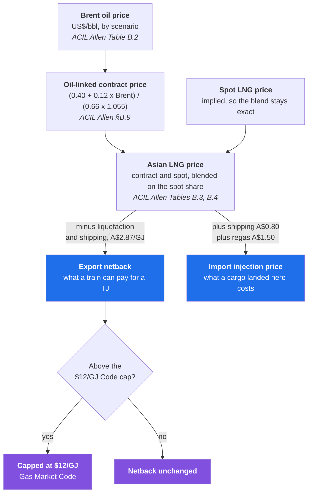
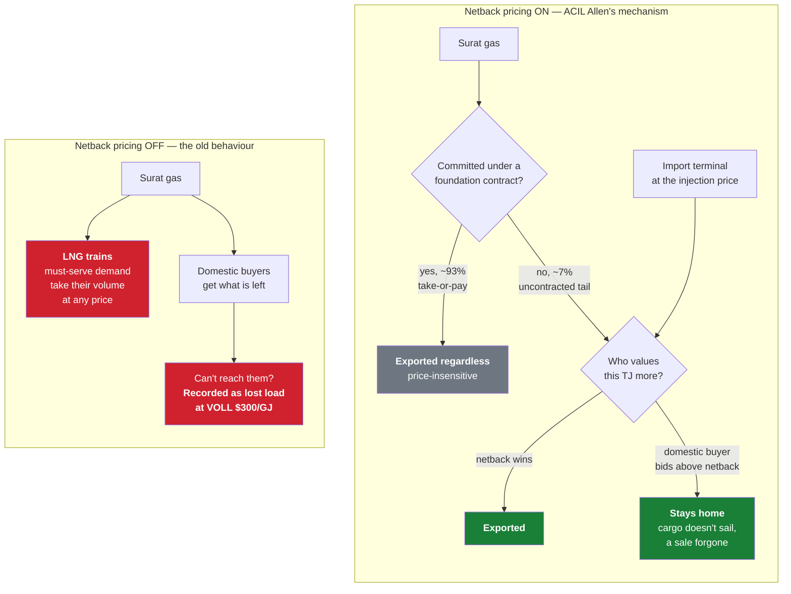

# Pricing

[← back to README](../README.md)

Three distinct price concepts live in GARY. Confusing them is the easiest way to misread
a result, so this page separates them.

1. [**The nodal price**](#1-the-nodal-price) — the dual of the balance constraint
2. [**The LNG netback**](#2-the-lng-netback) — what connects the domestic market to the world price
3. [**Customer-segment prices**](#3-customer-segment-prices) — ACIL Allen's contract/spot blend

Plus the section that matters most before quoting any of them:
[**What a GARY price is, and when it is not a wholesale price**](#what-a-gary-price-is-and-when-it-is-not-a-wholesale-price).

**Sources throughout:**
[ACIL Allen, *Wholesale natural gas prices for AEMO* (14 Nov 2025)](https://www.aemo.com.au/-/media/files/gas/national_planning_and_forecasting/gsoo/2026/2026-acil-allen-2025-projections.pdf) ·
[ACIL Allen, *Natural gas price forecasts for the Final 2023 IASR and for the 2024 GSOO* (14 Jul 2023)](https://www.aemo.com.au/-/media/files/major-publications/isp/2023/iasr-supporting-material/acil-allen-natural-gas-price-forecasts.pdf) ·
[ACCC LNG netback price series](https://www.accc.gov.au/inquiries-and-consultations/gas-inquiry-2017-30/lng-netback-price-series)

---

## 1. The nodal price

The dual of each node-day balance constraint: the marginal cost of one more TJ at that
node on that day. It is the cost of the cheapest thing not yet being done — run a dearer
field, pay a tariff, pull from storage, outbid an export cargo, or shed a tier at its
strike.

That is the number every price chart plots, and the number the **Final Price** KPI
summarises (production-weighted). See [`model.md`](model.md#reading-a-dual) for the
mechanics, including nodes whose dual is degenerate and therefore suppressed.

### It now includes a depletion cost, and that changes what it means

Since the supply side moved to a hard stock basis (30 Aug 2026) a GARY price is
**marginal social cost including depletion**, not marginal extraction cost. Two terms
sit inside it:

```
nodal price  =  extraction cost  +  scarcity rent  +  transport
```

The **scarcity rent** is the opportunity cost of using up a finite tranche: producing a
PJ today is a PJ unavailable later. Formally it is the dual on the capacity MIP's
reserve constraint — what the system would save if a basin held one more PJ. It is the
textbook Hotelling rent, and like any Hotelling rent it **grows at the discount rate**,
which falls out of the dual and the discount factor rather than being imposed.

It is not a payment anyone makes. Nobody is billed a rent; it is the shadow value of
scarcity, and it accrues to whoever owns the resource as economic profit.

**It compounds, and it used to run away.** Before the stock limit the term was implicitly
**zero** — GARY assumed gas was effectively unlimited, which was equally an assumption,
just an invisible one. Adding it then overshot in the other direction, and until 12
September 2026 it carried Queensland prices somewhere no buyer would go: **Gladstone
reached $26.91/GJ by 2050** against a netback of $7.12. That was the terminal value being
struck on a price the gas could not reach, plus a backfill tranche priced above the
tranche it replaces — see [`scarcity-rent.md`](scarcity-rent.md) and TODO item 21.

**Where it shows up now** (Step Change · Winter Medium · LNG Medium, measured):

| $/GJ, mean | 2025 | 2030 | 2040 | 2050 |
|---|---|---|---|---|
| Surat | 10.22 | 6.65 | 6.39 | **6.65** |
| Brisbane | 10.95 | 7.35 | 7.09 | 7.35 |
| Gladstone | 11.47 | 7.90 | 7.64 | **7.90** |
| Sydney | 10.27 | 8.74 | 8.24 | 8.48 |
| Adelaide | 9.91 | 9.61 | 8.60 | 8.54 |
| Melbourne | 9.32 | 10.01 | 9.03 | 8.95 |
| *Surat scarcity rent* | *0.70* | *0.98* | *1.93* | *3.79* |

Two things to read off it. **Queensland is anchored, not rent-bearing**: from 2030 Surat
sits at $6.65 — exactly what Surat 2C costs to lift — and Brisbane and Gladstone are that
plus their pipeline tariff to the cent ($0.70 on the RBP, $1.25 on the QGP). The scarcity
rent climbs to $3.79 and touches none of it, because by then the tranche it prices is
exhausted and a field producing nothing is never the marginal supplier. **The south is
capped by import parity** and barely moves: Melbourne runs $9.32 → $8.95 across the whole
horizon.

> **Read a rent-bearing price carefully.** A high dual at an import-inaccessible node
> is telling you the resource serving it is scarce and its replacement is not being
> built. That is a real result, but it is a statement about depletion and investment,
> not a forecast of what a buyer there would contract at.

## 2. The LNG netback

ACIL Allen produce the wholesale gas price projections behind AEMO's GSOO. Their model,
**GasMark**, is a partial spatial equilibrium LP over supply sources, demand points,
liquefaction and receiving facilities connected by pipeline and shipping arcs, solved to
maximise producer plus consumer surplus. GARY is the same class of model.

What GARY did not originally carry is the piece ACIL Allen identify as the thing that
actually sets east coast prices:

> "Price formation from 2026 is then based off the LNG netback pricing mechanism, which
> was the price setting mechanism until the price cap was introduced."
> — ACIL Allen (14 July 2023), §4.1

The **LNG netback pricing** switch supplies it. It is **on by default**
(`netback_pricing_default` on the Parameters sheet).

```bash
python src/solve.py --netback-pricing --winter High --lng High
```

### In plain terms

Australia's east coast is joined to the world market by three LNG trains at Gladstone. A
producer with a spare TJ has two customers: a domestic buyer, or a train that will
liquefy it and ship it to Asia. What the train can pay is the Asian LNG price **less the
cost of getting it there** — liquefaction and shipping. That figure is the **netback**,
and it is the floor under what a domestic buyer has to beat.

**Before this change, GARY had no idea any of that existed.** The trains were written in
as demand that simply had to be met, like a hospital. They took their gas first, at any
price, and if the pipes could not also serve Melbourne in a cold snap the model recorded
that as households losing supply. Exports could never lose.

**Now the trains bid like everyone else — for the part of their gas that is actually up
for grabs.** Most export volume is locked into long-term take-or-pay contracts and goes
whatever the price. The rest, roughly 7%, is the uncontracted spot tail, and *that* is
what gets bid for. When gas is plentiful the trains take it, because nobody domestic is
bidding higher. When a southern winter bites and Melbourne is worth more than the
netback, **that gas stays home instead** and the cargo simply does not sail. A sale
forgone, not a blackout.

Two consequences fall straight out of it:

- **Domestic prices get a ceiling.** No buyer pays wildly more than export parity for
  long, because at that point the gas is worth more here than abroad and the export stops
  instead.
- **Imports get a real price.** The Port Kembla terminal used to sit at a flat $14/GJ
  forever. It now costs what imported LNG actually costs — the Asian price plus shipping
  plus regasification — which rises and falls with the world market like everything else.

### How the price is built



Only two numbers leave this chain and enter the model: the **export netback**, which is
what each train will pay, and the **import injection price**, which is what an import
terminal costs to run.

### How it changes the model



**Off**: the three Queensland trains are ordinary must-serve demand nodes. Their volume is
taken at any price, unserved export is penalised at VOLL like lost household load, and no
export price enters the model anywhere. Exports can never lose to a domestic buyer.

**On**: each train becomes a bounded **willingness-to-pay block valued at the export
netback**, entering the objective as a negative cost. Gas reaches a train only while it
can be got for less than the netback, and a domestic buyer willing to pay more outbids
the export stream. LNG **imports** are simultaneously repriced from the flat $14/GJ in
`supply.csv` to ACIL Allen's year- and scenario-varying **injection cost**.

A netback run carries a `_Netback` scenario-key segment either way, so netback and
must-serve scenarios never collide in the cache.

### The price series

`src/build_lng_prices.py` builds `data/lng_prices.csv` from committed source assumptions
in `data/acil_lng_anchors.csv` and `data/acil_lng_params.csv`. Everything comes from ACIL
Allen, *Wholesale natural gas prices for AEMO*, Final Report, **14 November 2025** — the
report behind the **2026 GSOO**, the same vintage as GARY's demand baselines. Its three
scenarios carry the same names as GARY's three baselines, so they map one to one with no
interpretation.

| Step | Source |
|---|---|
| Brent oil price, anchored 2025/2030/2040/2050 | Table B.2 |
| Oil-linked contract LNG price `P_LNG = (FC + S·Pb)/(FX·C)`, FC = US$0.40/mmbtu, S = 0.12, FX = 0.66, C = 1.055 | §B.9 |
| Spot share of LNG sales | Table B.3 |
| Blended Asian LNG price (treated as primary) | Table B.4 |
| Implied spot price, backed out so blend/contract/spot stay consistent | derived |
| Import injection price = Asian LNG + $0.80 shipping + $1.50 regas | Table 2.1 / §B.11 |
| Export netback = Asian LNG − netback deduction, then capped | see below |

The generator **asserts** that it reproduces ACIL Allen's published injection-cost table
(Table 2.1) to the cent, so the adders cannot drift away from the source silently.

Step Change netback: **$11.12/GJ (2025) → $8.40 (2030) → $7.63 (2040) → $7.12 (2050)**.
Slower Growth rises to the $12 cap by 2040; Accelerated falls to $3.94 by 2050.

### The one number that is not published

The **export netback deduction** — avoidable liquefaction (plant short-run marginal cost
plus fuel gas) and shipping — is commercial-in-confidence. ACIL Allen do not publish it,
and neither does the ACCC, whose netback series uses the same avoidable-cost framework
with figures obtained directly from the Queensland LNG producers.

> The default **A$2.87/GJ** is the midpoint of the publicly discussed US$1.5–2.5/mmbtu
> range at ACIL Allen's own FX and heat content. **It is a choice, not a source.** It
> lives in `data/acil_lng_params.csv` and it is the first number to test if a netback
> result matters to a conclusion.

GARY does *not* deduct the Wallumbilla→Gladstone pipeline leg the ACCC deducts: the
netback here is struck at the train node, already downstream of the APLNG/GLNG/WGP feed
pipes and their tariffs in `arcs.csv`. Deducting it again would double-count.

### Gas Market Code price cap

The Commonwealth's $12/GJ cap is applied the way ACIL Allen apply it — as a ceiling on
the *netback*, not bolted onto domestic prices:

> "The price cap is operationalised in our model by setting the LNG netback price
> (measured at Wallumbilla) to not move above $12/GJ." — ACIL Allen (14 July 2023), §4.1

That rule is **self-terminating**, so no end year is needed: once long-run LNG prices pull
the netback below $12 the ceiling stops binding, which is ACIL Allen's own assumption
about how the Code lapses.

Their 2025 report is sceptical it binds at all — *"the price cap has not necessarily
acted as a price cap, but more like a price floor"* (§2.3.1) — so the capped series is
the conservative reading, not a consensus one. `Netback_Uncapped_AUD_GJ` is emitted
alongside so the difference is always visible.

> In practice the $12 cap **never binds** in Step Change or in Accelerated Transition —
> `Netback_Uncapped_AUD_GJ` equals `Netback_Capped_AUD_GJ` in all 26 years of both. It binds only in Slower Growth,
> 2040–2050.

### Foundation contracts and the contestable tail

Not all export volume is contestable, and treating it as if it were would overstate what
any price signal — or any policy — can move. Planned export volume splits in two, the way
the east coast actually sells gas:

- **Foundation volume** — the take-or-pay share sold under long-term SPAs. Price-
  insensitive by construction: the cargo goes whatever the netback. It stays in the model
  as ordinary must-serve demand.
- **The spot tail** — everything else the train could liquefy. It bids at the netback, and
  it is what a domestic buyer (or a reservation) can actually take.

The split is set by `lng_foundation_share`, **0.93**, derived from public data: the ACCC
publishes Queensland LNG producers' uncontracted gas each quarter and reported **22 PJ**
available for Q1 2026, against ~325–330 PJ of quarterly exports — about 7% uncontracted.
ACIL Allen confirm the structure: *"the supply under foundation customers is untouched in
our modelling, LNG exporters then supply the domestic market and export further gas via
spot cargoes"* (§2.3.2).

> It is **one quarter's figure**, so treat it as a key sensitivity — it sets how much
> export volume is contestable at all.

The spot block's ceiling is **physical liquefaction nameplate** less the foundation
volume. That replaced an earlier `export_headroom` multiple, which was an arbitrary number
standing in for a capacity the model already knew. It also means spare liquefaction can
*absorb* cheap gas, so the netback **anchors** domestic prices in a well-supplied year
rather than only capping them in scarcity.

The nameplate itself is read **per train from the Gas Bulletin Board** — APLNG 1,591 +
GLNG 1,384 + QCLNG 1,420 TJ/day, taking the *process* figure where the GBB publishes both
process and receive — and then scaled by `lng_availability` = 0.897, the best annual
utilisation on record (AEMO Figure 19 actuals), because an MDQ is a day's maximum and GARY
has no maintenance model. Fleet limit **3,942 TJ/day**, exactly what the trains consumed in
2024. Until 12 September 2026 it was a flat 3,680 TJ/day, which was a *demand* figure
reused as a capacity and sat below both observed throughput and GARY's own input — see
[`the-2040s.md`](the-2040s.md) §6.

## What a GARY price is, and when it is not a wholesale price

**A GARY price is a marginal cost, not a price anyone pays.** ACIL Allen report something
different — what a customer contracts to pay. They say so themselves:

> "Our GasMark model models hypothetical spot prices and does not model gas contracts
> specifically… Contract prices could be expected to be slightly higher than this price to
> take account of contract terms such as take or pay, interruptible and other services
> that are provided." — ACIL Allen (14 Nov 2025), §3.1

Three things sit between the two. Only one of them is large, and it is the one that makes
GARY's **short run** unusable as a wholesale price forecast.

### 1. Cost basis — the big one, and it is time-varying

A marginal cost is only comparable with a contract price when the marginal unit is
carrying its full costs. AEMO's note on the G26 *Production Costs* sheet is where the
line sits:

> "Costs include **operating cost, capital costs, royalty, tax and a return on
> capital**… For developed reserves production costs include largely **marginal
> operating costs**, royalties and tax. For undeveloped reserves, marginal costs also
> include the cost of **drilling and completion and marginal gas processing plant
> costs**."

**GARY takes that split literally, and the consequence runs the opposite way to what
you might expect.** Since the supply restructure of 30 Aug 2026 a basin's 2C tranche
carries its *operating* basis in the commodity cost, with the capital charged as
CapEx on the development that unlocks it (see
[`model.md`](model.md#costing-a-development-what-is-published-and-what-is-not)). So a
nodal dual now reflects an operating cost plus whatever scarcity rent the binding
constraints produce — **in every year, at both ends of the horizon.** Capital is
recovered through those rents, not through the marginal cost.

That is the textbook short-run competitive result and it is the appropriate treatment.
It also means the mechanism that used to close the gap with ACIL Allen late in the
horizon — the marginal unit becoming a full-cost 2C number around 2032 — **no longer
exists.** GARY's duals are a short-run marginal cost throughout.

> **Do not read that as a target to hit.** GARY and ACIL Allen measure different
> quantities: a system marginal cost against a contract-reflective price that carries
> a market-power overlay GARY deliberately omits. Where the two agree it is worth
> understanding why; where they disagree that is information, not an error to tune
> out. The methodology is chosen because it is the right treatment of AEMO's cost
> data, not because of where it lands relative to a published forecast.

**The price table in this section was measured against the old cost-step structure
and has not been re-measured since the restructure.** Do not quote it. Re-run and
replace it before using any figure here.

### 2. Contract/spot blending — small, and not currently reproducible

ACIL Allen run GasMark **twice**: Run 1 is an annual, contract-reflective price *with* the
Gas Market Code cap; Run 2 is a monthly series *without* it. They then blend the two per
customer segment. `acil_segment_prices.py` carries the weights but derives both legs from
**one** solve, by aggregating the same daily duals two ways. Those are not two prices —
they are two summaries of one price vector, and they behave like it:

| contract leg − spot leg, $/GJ | Melbourne | Sydney | Adelaide | Brisbane |
|---|---|---|---|---|
| 2026 | +0.82 | +0.07 | +0.38 | +0.05 |
| 2028 | −0.41 | −0.16 | +0.16 | +0.08 |

They differ by cents, and the sign is not stable. ACIL Allen's spot leg is structurally
the higher, more volatile one **because the cap is lifted on it**; GARY's cannot be,
because `code_price_cap` is applied to the netback inside the solve and both legs inherit
it. Reproducing their construct needs a second solve with
`GasMarketModel(code_price_cap=False)`, which already selects the
`Netback_Uncapped_AUD_GJ` column `build_lng_prices.py` emits — no caller passes the flag
today. At weights of 100/0 and 90/10 the blending is second-order anyway: doing it
properly makes the comparison *well-defined*, it does not move the level.

### 3. The Step 2 overlay — deliberately absent

Vertical integration, gentailer portfolio effects, market power, and inflating new supply
costs toward netback because new entrants price off their next best alternative. See
[below](#what-is-deliberately-missing--market-power-and-the-step-2-overlay) for why it is
left out.

Note the implication: ACIL Allen say the overlay **adds** to their numbers, so a GARY that
omits it should sit below them in 2050 as well — **and it does not.** Either the overlay is
small by then or something in GARY is running high there. Treat the long-run agreement as
unconfirmed until that is checked.

### How to read a GARY price

- **Nodal duals are system marginal costs.** They are the right number for "what does the
  next TJ cost", for ranking scenarios against each other, and for valuing a pipeline, an
  expansion or a policy at the margin. That is what the model is for.
- **They are not a wholesale price forecast, least of all before ~2032.** Do not quote a
  GARY 2026 number as a wholesale gas price. It is roughly half of one, for a structural
  reason, and the reason is above.
- **Comparisons with ACIL Allen are only meaningful once the segment layer is used**, and
  even then GARY is their mechanical layer only.

## 3. Customer-segment prices

`src/acil_segment_prices.py` is a **post-processing step over a solve that already
happened**: it adds no constraint, changes no quantity and re-solves nothing. It appears
at the bottom of the **Prices** tab.

| Segment | Contract | Spot | Premium | Source |
|---|---|---|---|---|
| Residential/commercial | 100% | — | — | §2.6.1: *"supply for this market is 100 per cent contracted"* |
| Industrial | 90% | 10% | — | §2.6.2, applied to all regions |
| GPG — CCGT | 80% | 20% | — | §2.7, baseload role |
| GPG — OCGT | 20% | 80% | $1.00/GJ | §2.7, *"based on their 'peaking' role and their low load factor"* |

Weights live on the `Segment_Weights` sheet, mirrored in `data/acil_segment_weights.csv`.

### How the two legs are built

**Contract leg — one price per node.** The annual mean of the daily duals, weighted by
**total delivered volume across every tier that pays for gas**: distribution, GPG and
industrial. A contract is struck once for the year, so the price it should reflect is the
price of the average gas actually delivered; a flat mean over 365 days lets quiet summer
days pull it down.

> This is a correction. The weights used to come from the GPG and industrial served series
> **only**, because distribution volume was not emitted anywhere in the results. At
> Melbourne that meant ~23,000 TJ of GPG-and-industrial standing in for ~175,000 TJ of
> actual load — 13% of the volume setting the weight for a segment that is 100% contract
> and the largest load in the model. `model.py` now emits a `distribution` series for
> exactly this purpose.

**Spot leg — one price per node PER SEGMENT.** The annual mean of the same daily duals,
weighted by **that segment's own daily profile**. A buyer purchasing at spot pays the
price on the days it actually consumes, so a winter-peaking household and a flat-running
refinery face different average spot prices out of one price series. Weighting both legs
identically — which this module used to do — collapsed the segments onto nearly one
number: measured, the two legs differed by 4c–82c with an unstable sign.

GARY does not model CCGT and OCGT demand separately, so those two share the GPG profile
and differ only through their weights and the OCGT premium.

### Run 1 and Run 2

`segment_prices()` takes an optional `uncapped_results=` for ACIL Allen's second,
cap-free run, and records which mode was used in a `TwoRun` column. Without it the capped
solve feeds both legs. As noted [above](#gas-market-code-price-cap), the cap never binds
in two of the three baselines, so the one-solve approximation is exact there and the
second run is only worth paying for on Slower Growth.

### What is deliberately missing — market power and the Step 2 overlay

**These prices are ACIL Allen's mechanical layer only.** On top of everything above, ACIL
Allen apply a second step that GARY does not reproduce:

- vertical integration and gentailer portfolio effects;
- **market power**;
- "inflating" new supply costs toward the netback, because a new entrant prices off its
  next best alternative rather than off its own cost.

That is judgement applied outside their model, per generator and per contract. None of it
is reproducible from published material, and guessing at it would put a number on this
output that looks like ACIL Allen's and is not.

**The consequence is directional and worth stating plainly: GARY's segment prices will sit
BELOW ACIL Allen's published forecasts wherever that overlay adds to them, and the gap is
not evidence that either is wrong.** It is the overlay.

Two smaller gaps in the same direction:

- the **$1.00/GJ OCGT premium is GARY's number**. ACIL Allen state that a premium exists
  and why — *"the additional costs they typically pay to source high volumes of gas at
  short notice… reserving pipeline capacity or the costs of storage"* — but do not
  quantify it.
- the segment layer inherits whatever the duals inherit. If the marginal unit is priced at
  AEMO's 2P cost — largely operating cost — no reweighting turns that into a full contract
  price. That is the larger of the two effects in the near term.
